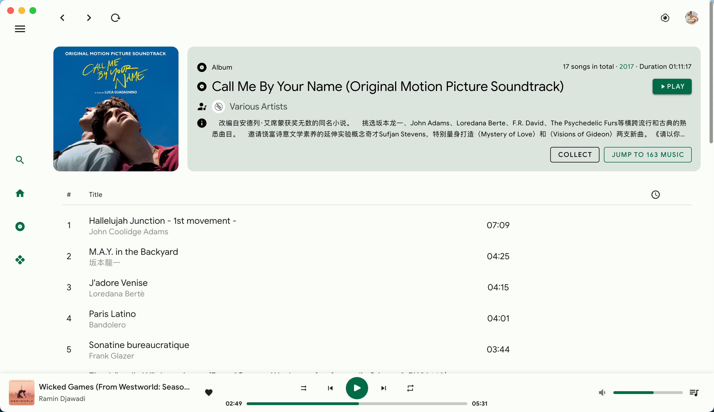
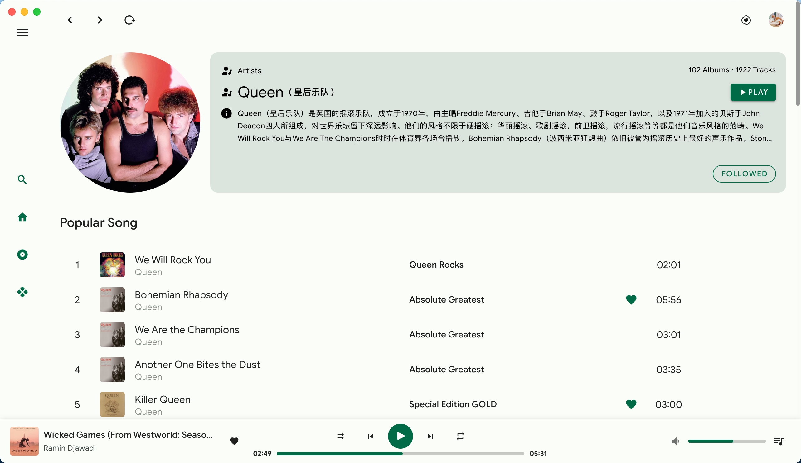
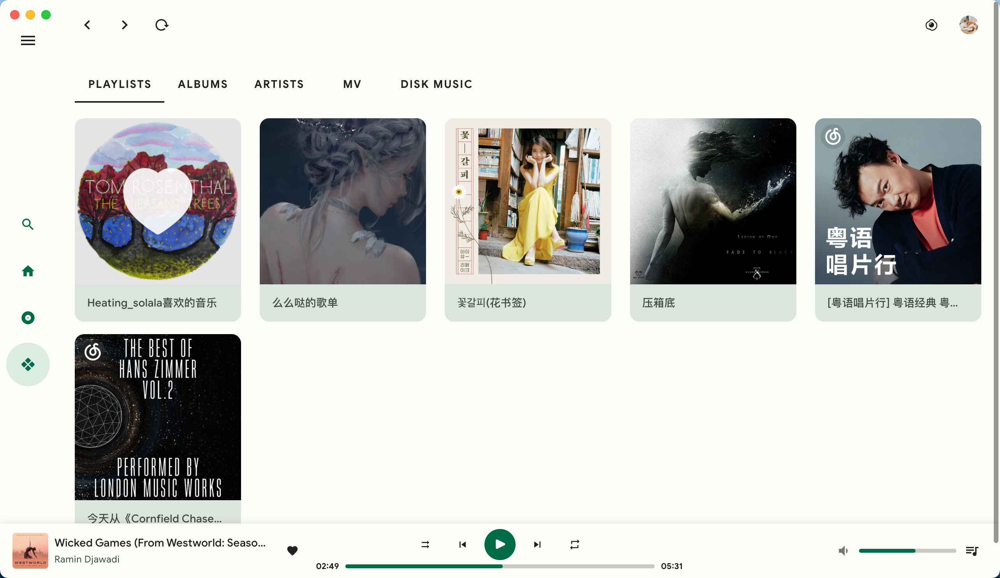
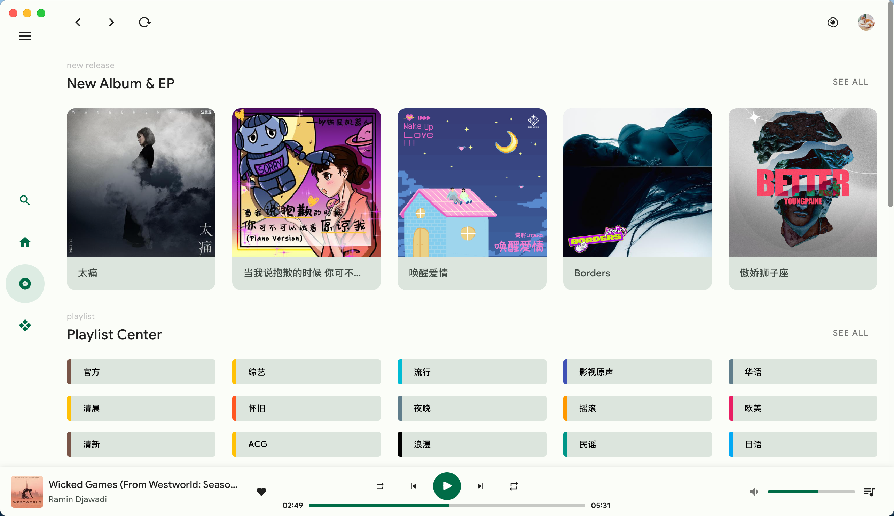
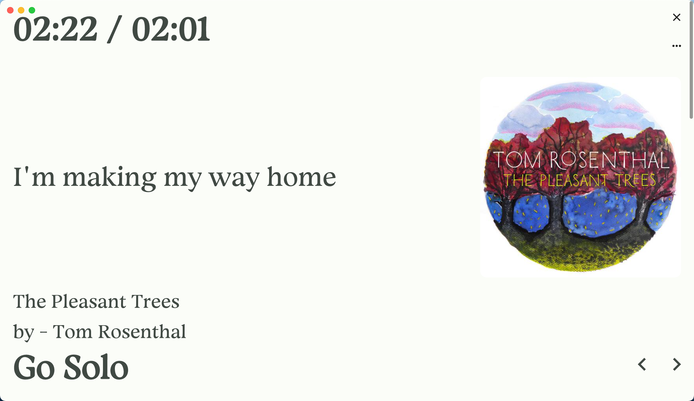

<p align="center">
  
</p>
<h1 align="center">
  VPlayer
</h1>
<p align="center">
    <a href="https://m3.material.io/" target="_blank"> Material Design 3 (Material You)</a> 风格的音乐播放器,采用网易云音乐非官方API NeteaseCloudMusicApi 接口
</p>

## Introduction

开发基于 vue 全家桶 + vuetify + [NeteaseCloudMusicApi](https://github.com/Binaryify/NeteaseCloudMusicApi) + electron, 提供网易云音乐的基础功能。[🎵 网页版](https://v-player.vercel.app/) (vercel 部署，可能有点慢 😁， 建议下载桌面客户端体验)

vue3 + ts 重构 2.0 版本

🎨 已有功能

- 单纯的播放器，不能网抑云
- 支持手机号，手机扫码登录
- 资料库
- 日推，私人 fm, mv 播放
- 适配黑暗模式
- 歌词
- 桌面客户端

🏗 Work In Progress

- 下载歌曲/mv/封面

...and more

<picture>
  <source media="(prefers-color-scheme: dark)" srcset="./doc/dark-home.png">
  
</picture>

## 运行

### 安装依赖

```
npm install
or
yarn install
```

### 启动服务

需要本地部署 [NeteaseCloudMusicApi](https://github.com/Binaryify/NeteaseCloudMusicApi)

需要解锁网易云灰色歌曲可以 clone 部署 fork NeteaseCloudMusicApi 的仓库 [NeteaseCloudMusicApi](https://github.com/GuMengYu/NeteaseCloudMusicApi), 解锁接口来自 [UnblockNeteaseMusic](https://github.com/UnblockNeteaseMusic/server)

```
npm run dev
```

### 打包客户端

```
npm run electron:build
```

## 预览

<picture>
  <source media="(prefers-color-scheme: dark)" srcset="./doc/album-dark.png">
  
</picture>

<picture>
  <source media="(prefers-color-scheme: dark)" srcset="./doc/artist-dark.png">
  
</picture>
<picture>
  <source media="(prefers-color-scheme: dark)" srcset="./doc/center-dark.png">
  
</picture>
<picture>
  <source media="(prefers-color-scheme: dark)" srcset="./doc/ground-dark.png">
  
</picture>
<picture>
  <source media="(prefers-color-scheme: dark)" srcset="./doc/lyric-dark.png">
  
</picture>
<picture>
  <source media="(prefers-color-scheme: dark)" srcset="./doc/setting-dark.png">
  
</picture>

## License

[MIT](/LICENSE)

## 最后

仅供学习交流使用，禁止个人用于非法商业用途。
