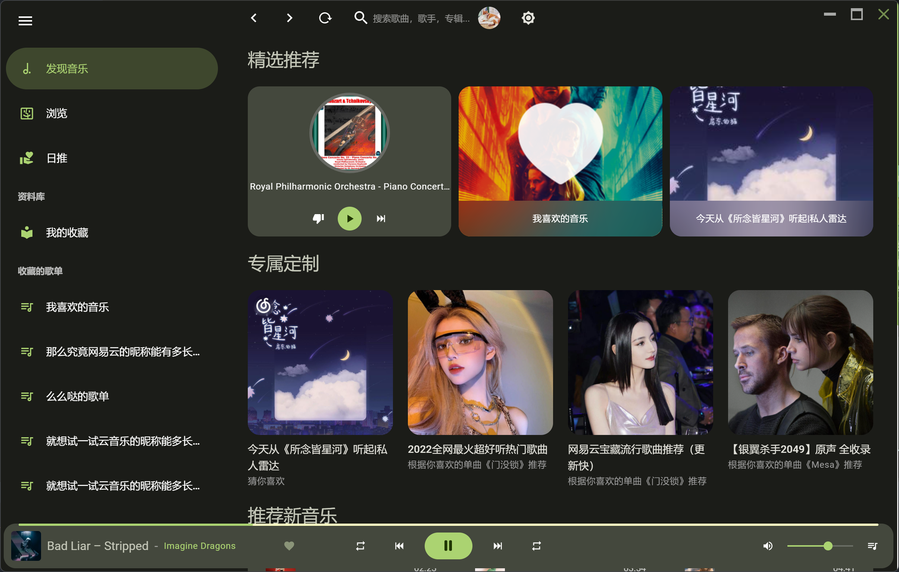
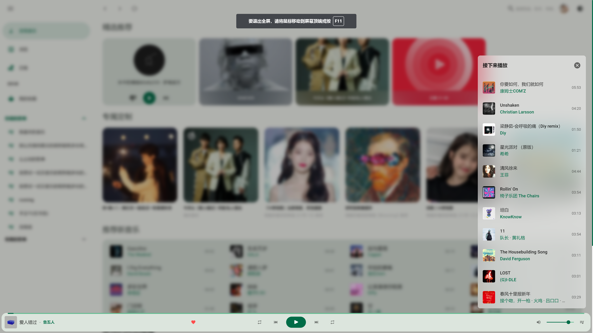
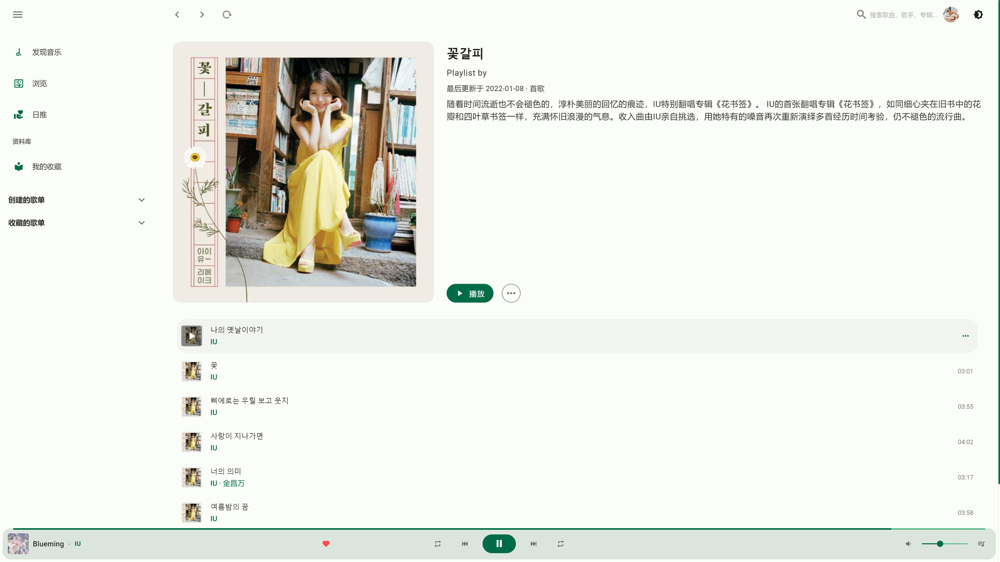
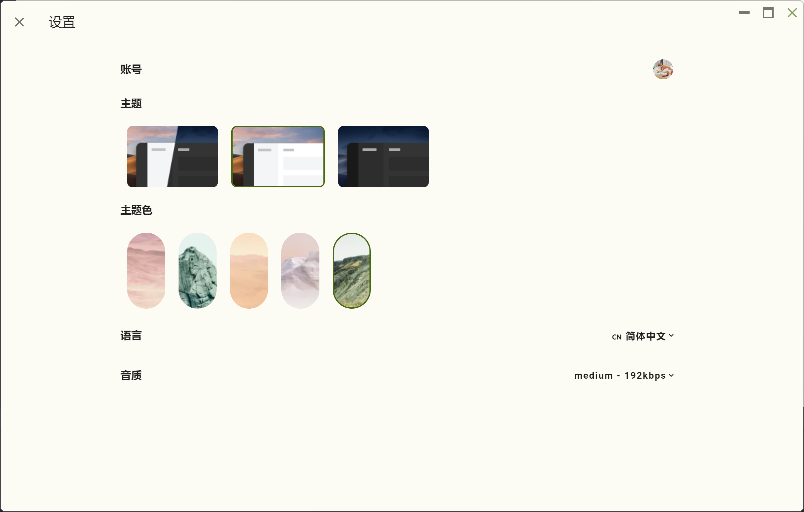

<h2  style="text-align: center">

<br>VPlayer
</h2>

<p style="text-align: center">
    <strong>
        一个 <a href="https://m3.material.io/" target="_blank"> Material Design 3（Material You） </a> 风格的网络音乐播放器,<br/>
        采用网易云音乐非官方API NeteaseCloudMusicApi做音乐接口服务
    </strong>
</p>


#### 开发基于vue全家桶 + vuetify + [NeteaseCloudMusicApi](https://github.com/Binaryify/NeteaseCloudMusicApi) + electron

[🎵网页版体验](https://v-player.vercel.app/) (vercel 部署可能有点慢 😁)

### 🎨 已有功能

- 🤡 单纯的播放器，不能网抑云
- 📱 支持手机登录
- 🎈 资料库
- 🛰 日推，私人fm
- 🎞 mv播放
- 🌗 适配黑暗模式
- 🛰 下载歌曲/mv/保存封面

🏗 Work In Progress...
- 📦 electron 打包多个客户端()
- 📜 歌词

### 🔧 安装
```
npm install 
// or
yarn install
```

### 🌏 启动网页端, 需要本地部署 [NeteaseCloudMusicApi](https://github.com/Binaryify/NeteaseCloudMusicApi)
```
npm run serve
```
### 🧬 打包electron
```
npm run electron:build
```

### 🌄 预览









### 📄 License
[MIT](/LICENSE)
### 仅供学习交流使用，禁止个人用于非法用途。


