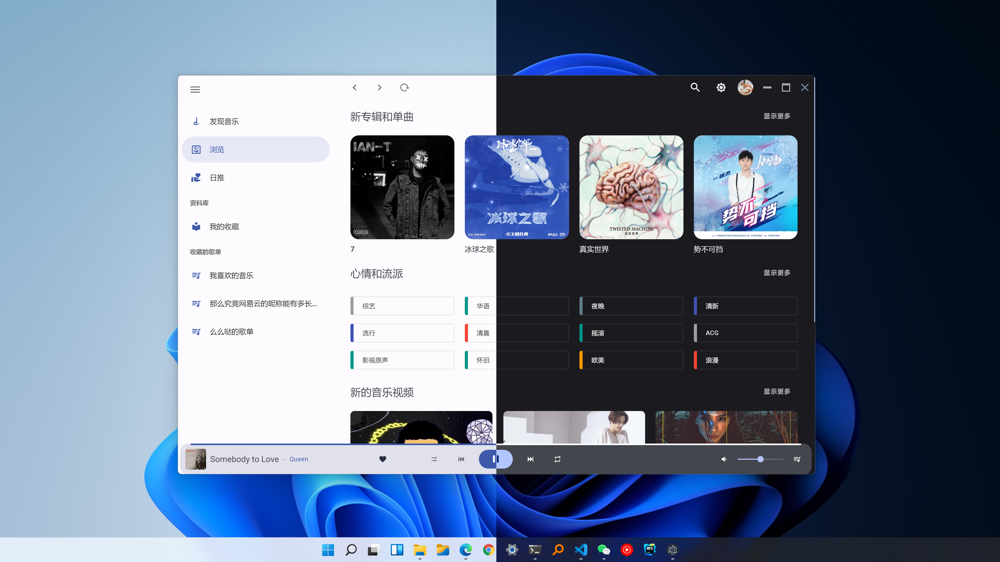

<p align="center">
  
</p>
<h1 align="center">
  VPlayer
</h1>
<p align="center">
    一个 <a href="https://m3.material.io/" target="_blank"> Material Design 3 (Material You)</a> 风格的在线音乐播放器,采用网易云音乐非官方API NeteaseCloudMusicApi做音乐接口服务
</p>


## Introduction

开发基于vue全家桶 + vuetify + [NeteaseCloudMusicApi](https://github.com/Binaryify/NeteaseCloudMusicApi) + electron, 提供简单的网易云音乐的播放功能。[🎵网页版体验](https://v-player.vercel.app/) (vercel 部署的可能有点慢 😁)


🎨 已有功能

- 单纯的播放器，不能网抑云
- 支持手机号，手机扫码登录
- 资料库
- 日推，私人fm, mv播放
- 适配黑暗模式
- 下载歌曲/mv/保存封面
- windows客户端(没mac, 没打出包😭)

🏗 Work In Progress

- 歌词
- 个人云盘

...and more



## 运行
### 安装依赖
```
npm install 
or
yarn install
```

### 启动服务
需要本地部署 [NeteaseCloudMusicApi](https://github.com/Binaryify/NeteaseCloudMusicApi)
```
npm run serve
```

### 打包客户端
```
npm run electron:build
```

## 预览

|  |  |
|:-----:|:-----:|
|Artist |Album |

|  | |
|:-----:|:-----:|
|Setting |Playing |

## License
See [MIT](/LICENSE)

## 最后
仅供学习交流使用，禁止个人用于非法用途。


