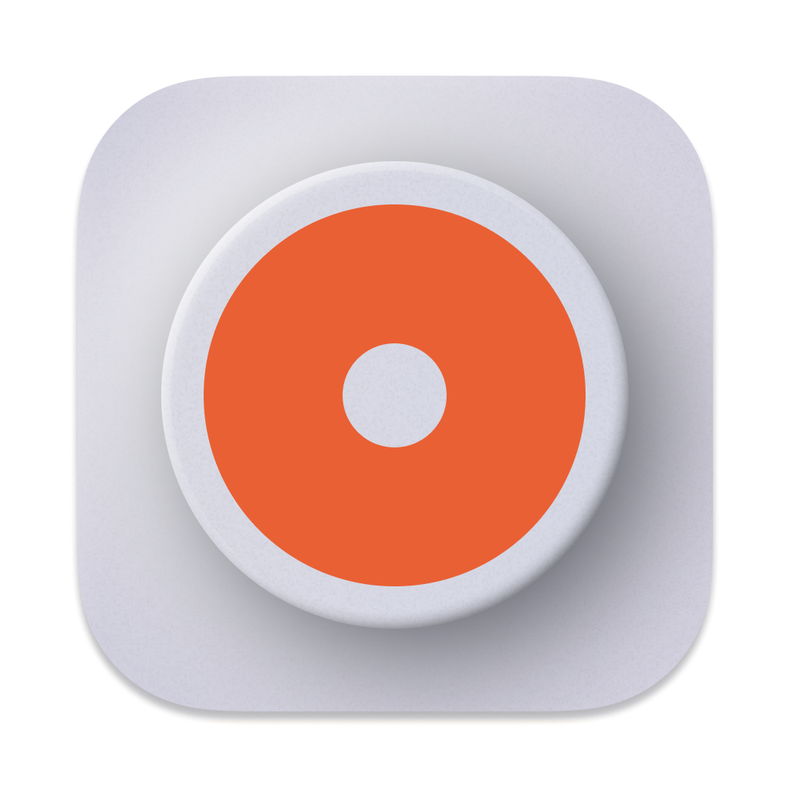
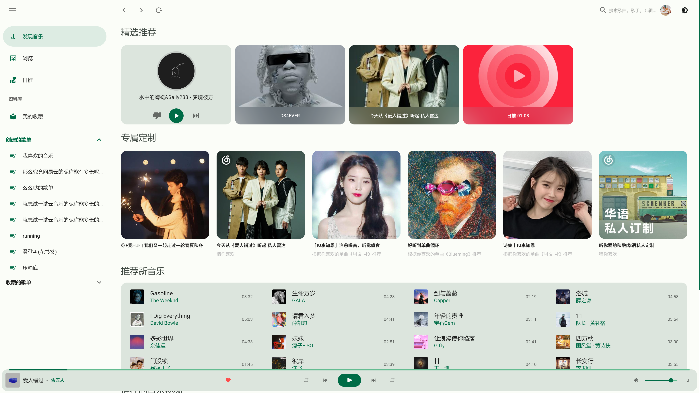
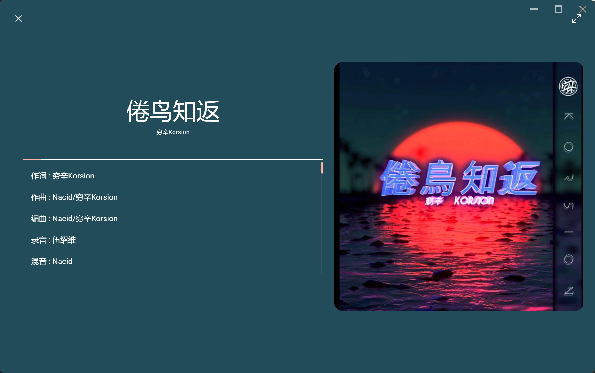

<h2 align="center">

<br>VPlayer
</h2>

<p align="center"><strong>一个 Material Design 风格的网络音乐播放器, 采用网易云音乐非官方API NeteaseCloudMusicApi</strong></p>


#### 开发基于vue全家桶 + vuetify + [NeteaseCloudMusicApi](https://github.com/Binaryify/NeteaseCloudMusicApi) + electron

下载桌面端[安装包](https://github.com/GuMengYu/v-player/releases)，
暂时没有提供网页端demo, 可自行克隆运行。

### 🎨 已有功能

- 🤡 单纯的播放器，不能网抑云
- 📱 支持邮箱手机登录
- 🎈 资料库
- 📜 歌词显示，日推，私人fm
- 🎞 mv播放
- 🌗 适配黑暗模式
- 📦 electron 打包多个客户端
- 🏗 Work In Progress...

### 🔧 安装
```
npm install 
// or
yarn install
```

### 🚀 启动 
```
npm run electron:serve
// or
yarn run electron:serve
```
### 🌏 启动网页端, 需要本地部署 [NeteaseCloudMusicApi](https://github.com/Binaryify/NeteaseCloudMusicApi)
```
npm run serve
```
### 🧬 打包
```
npm run electron:build
```

### 🌄 预览







### 📄 License
[MIT](/LICENSE)
### 仅供学习交流使用，禁止个人用于非法用途。


